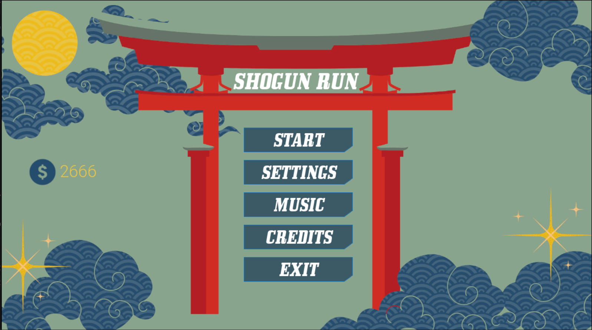
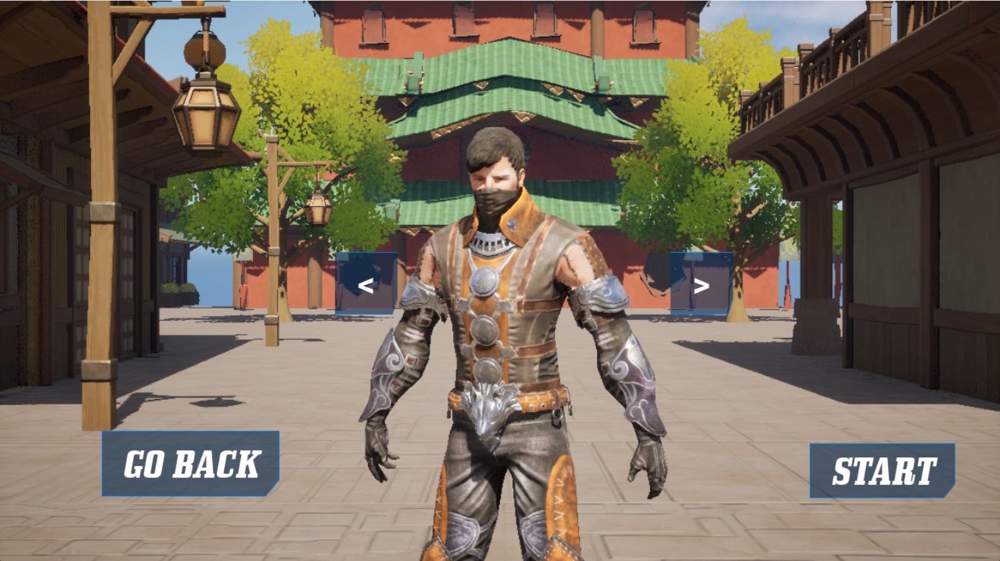
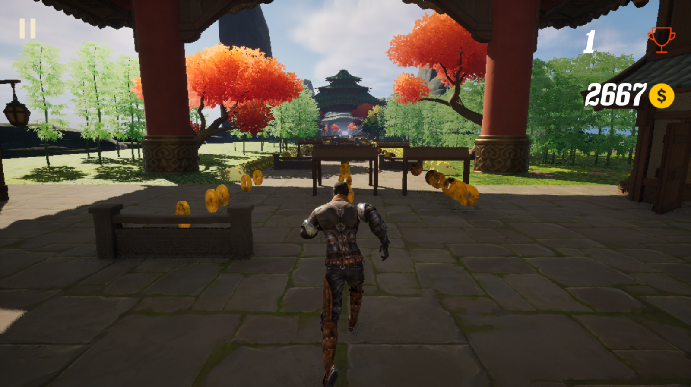
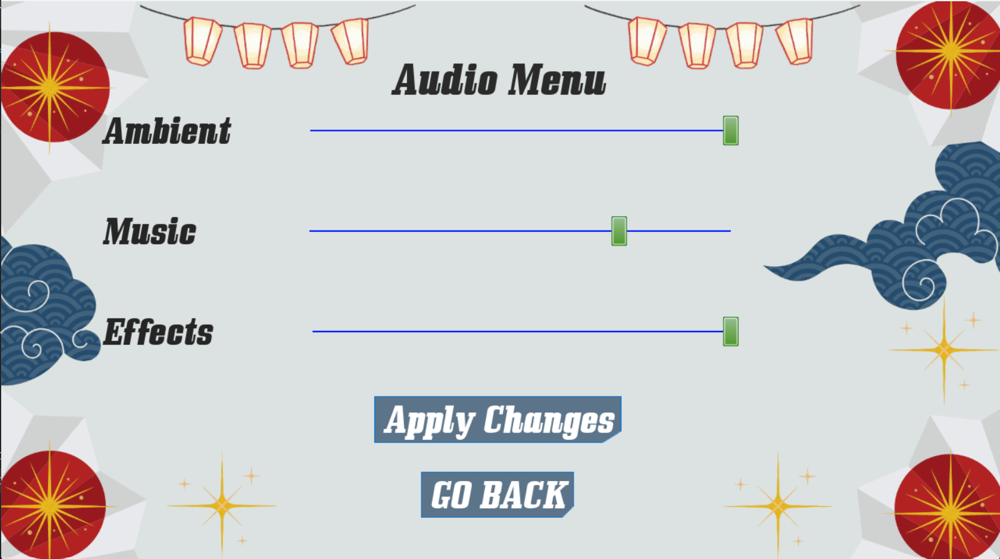
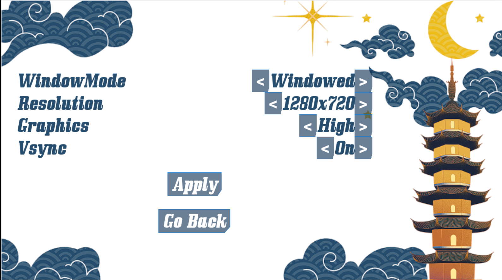
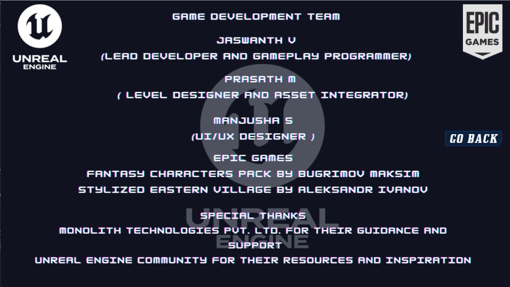

# Shogun Run 🏃‍♂️🎮

**Shogun Run** is an **endless running game** set in a Japanese-themed environment, developed using **Unreal Engine 5**. The game challenges players to navigate through obstacles, collect coins, and experience increasing speed as they progress.

---

## 🎥 Demo Video  
[Watch the Demo Video](https://drive.google.com/file/d/1yoYWegpOungoY-t6G-XN-q1WvrDH0Qeh/view?usp=sharing)

## 📦 Game Download  
[Download the Compressed Game File](https://drive.google.com/file/d/13ZYG9poVaq8hHupiEMZoQsM_rmujmnZa/view?usp=sharing)

---

## 🚀 Features

1. **Main Menu**  
   - Start, Options, Credits, and Exit buttons.  
   - Includes a loading page after pressing Start.

2. **Character Selection**  
   - Choose from 3 unique characters before starting the game.

3. **Gameplay**  
   - Countdown before the game starts: **3, 2, 1, Go!**  
   - Endless running through Japanese-themed environments:  
     - **Urban Environment**: Buildings and mountains.  
     - **Forest Environment**: Bamboo trees and lush greenery.  

4. **Obstacles and Controls**  
   - Navigate around obstacles using:  
     - **W**: Jump  
     - **A**: Move Right  
     - **D**: Move Left  
     - **S**: Slide  
     - **P**: Pause  

5. **Coins and Score**  
   - Collect coins displayed on the screen.  
   - Score increases as you progress.

6. **Power-ups**  
   - Magnet power-up attracts nearby coins for **5 seconds**.  
   - Includes a progress bar showing the remaining power-up time.

7. **Game Speed**  
   - Increases drastically as the player progresses.

8. **Game Over**  
   - The game ends when the player hits an obstacle.  
   - Option to continue by spending **50 coins**.

9. **Audio Effects**  
   - Footsteps, jump sounds, and dash sounds enhance the experience.

10. **Pause Menu**  
   - Press **P** to pause the game anytime.

11. **Platforms**  
   - Available on **Android** and **Windows**.

---

## 📷 Screenshots  

### Main Menu  

### Loading Screen  

### Character Selection  

### Game Start  

### Game Over Screen  

### Music Settings  

### Settings Menu  

### Credits  

---

## 🛠️ Development

- **Engine**: Unreal Engine 5  
- **Programming Language**: Blueprints (visual scripting)  

---

## 🔗 Links  
- [Demo Video](https://drive.google.com/file/d/1yoYWegpOungoY-t6G-XN-q1WvrDH0Qeh/view?usp=sharing)  
- [Download the Game](https://drive.google.com/file/d/13ZYG9poVaq8hHupiEMZoQsM_rmujmnZa/view?usp=sharing)

---

## 📧 Contact  
If you have any queries or feedback, feel free to contact:  
**Developer**: Jaswanth V , Prasath M , Manjusha S

**GitHub**: [JaswanthVadivelan](https://github.com/JaswanthVadivelan)  
**LinkedIn**: [Jaswanth Vadivelan](https://www.linkedin.com/in/jaswanthvadivelan/)

---

## 📝 License  
This project is licensed under the **MIT License**. Feel free to use and modify the game with proper attribution.
